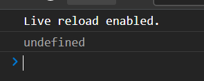
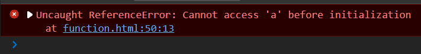

## 声明变量

### let

> ES6新增了声明变量的关键字即let

#### 不可重复声明

`let`是无法重复声明变量的，重复声明会报错，`var`重复声明不会报错

```js
let str = "str"
let str = "cxy"
```

#### 块级作用域

`let`声明的变量只能在声明所处的块级作用域中存在，但是**作用域链**依旧还是起作用的

```js
{
    let str = "cxy"
}
console.log(str) //不存在
```

### const

#### 声明常量

我们在使用`const`来声明常量的时候，我们需要为其赋初始值，并无法被修改，其常量名需要大写

```js
const SCHOOL = "学校"
```

但是如果声明的是数组，我们可以修改数组内的元素值，因为我们是不改变地址的，声明不会报错。

#### 块级作用域

`const`和`let`相同都是作用于块级作用域

### var和let在编译下不同的过程

#### var

在我们使用`var`来声明一个变量并赋值的时候，过程是这个样子的，在所以代码执行之前都会根据所有`var`来开辟空间，命名变量（变量为指向该空间的引用），然后编译向下执行，直到执行完为止，如果在执行过程中遇到了再次声明同一个`a`，那么`var`声明的话会合并相同的变量，直到执行到代码中定义`var`的部分再进行赋值操作，最后改变量会被最后赋值操作所执行，简单总结来讲即**先创建再赋值**

```js
console.log(a)
var fn = function() {
    console.log(a)
}
var a = 1;
var a = 2;
```



这里出现`undefined`说明了已定义但是未赋值，所以var的执行顺序如下

```js
var fn
var a;
a = 1;
a = 2;
```

#### let

在我们使用`let`赋值的时候，过程是这个样子的，当我们只有执行到`let`语句的时候，编译器才会去创建一个空间，并立刻去赋值，因为这个原因所以如果我们再次使用`let`声明相同的变量的时候，就会出现错误。

```js
console.log(a)
let a = 1;
```



这里就是`let`执行机制的体现，即未声明

```js
let a = 1;
```


