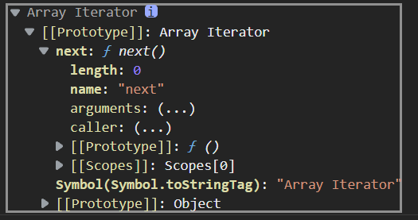
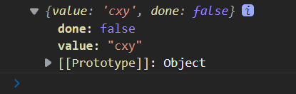
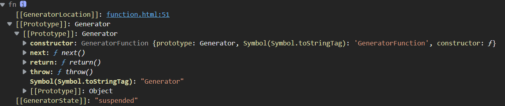
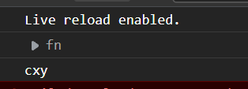
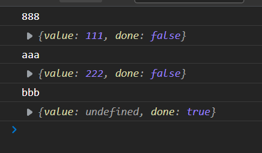

## 迭代器

> 迭代器是一种接口，为各种不同的数据结构提供统一的访问机制，任何数据结构只要部署了`lterator`接口，那么就可以完成遍历操作

ES6新增了一种遍历的命令即`for of`而`iterator`接口主要供`for of`来使用

```js
let arr = ['cxy','zrx','mxr']
for(let item of arr) {
    console.log(item)
}
```

### 工作原理

1. 创建指针对象，指向当前数据结构的起始位置

   ```js
   let arr = ['cxy','zrx','mxr']
   let iterator = arr[Symbol.iterator]()
   console.log(iterator)
   ```

   

2. 第一次调用nexr方法，指针直接指向数据结构的第一个成员

   ```js
   console.log(iterator.next())
   ```

   

   

3. 接下来调用对象的`next`方法，指针一直向后移，知道最后一个成员

4. 每调用`next`方法返回一个包含`value`和`done`属性的对象

迭代器并不知道`next`下一个对象是否迭代完毕，所以通过`done`来判断是否迭代完毕，`done`是一个布尔值。

值得注意的是迭代器维护着可迭代对象，会阻止垃圾回收机制回收可迭代对象

### 应用

> 迭代器一般用于我们的意愿遍历数据的场景

```js
const obj = {
    name:"cxy",
    arr:[
        'mxr',
        'zrx',
        'wb'
    ],
    [Symbol.iterator]() {
        let index = 0
        let _this = this
        return {
            next: function() {
                if(index < _this.arr.length) {
                     	const result =	{
                    	value:_this.arr[index],
                    	done:false
                	}
                        index++
                    return result
                }else{
                    return {value:undefined ,done:true}
                }
            }
        }
    }
}
for(let item of obj) {
    console.log(item)
}
```

## 生成器

> 生成器就是一个函数，可以用来做异步即纯回调函数

```js
function * fn() {
    console.log("cxy")
}
let iterator = fn()
console.log(iterator)
```

我们从上面的打印结果来看函数内的打印结果没有出现，这说明了异步函数，不会被立即执行，而且也证明了他是一个迭代器对象，内含`next`方法



由此我们可以调用`iterator`中的`next`方法来调用运行

```js
iterator.next()
```



### yield

值得注意的是在生产器中可以使用`yield`语句，那么何为`yield`语句呢？

`yield`可以视为函数代码的分隔符，将函数分割成几块，在官网文档给出的解释是用来**暂停和恢复**一个生成器函数

```js
function * fn() {
    console.log("cxy")
    yield 'first'
    console.log('zrx')
    yield 'second'
    console.log('wb')
    yield 'third'
    console.log('mxr')
}
let iterator = fn()
iterator.next() // cxy
iterator.next() // zrx
// 以此类推
```

### 函数参数

`next`内的参数为对应`yield`的返回值

```js
function * fn(str) {
    console.log(str)
    let one =  yield 111
    console.log(one)
    let two = yield 222
    console.log(two)
}
let iterator = fn('888')
console.log(iterator.next())
console.log(iterator.next('aaa'))
console.log(iterator.next('bbb'))
```


