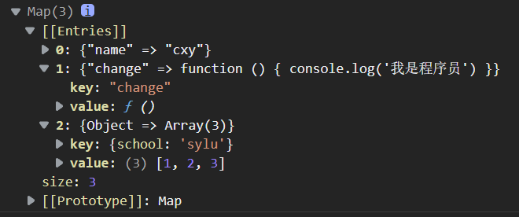

## 集合类型

ES6新增了新的数据结构，它类似于数组，但是成员的值都是唯一的，并且集合实现了`iterator`接口，所以我们可以使用扩展运算符来对其进行展开，所以可以使用`for of`进行遍历。

### 集合属性和方法

1. `size()`：返回集合的元素个数
2. `add()`：增加一个新的元素，并返回当前集合
3. `delete()`：删除元素。并返回布尔值
4. `has()`：检测集合中是否包含某个元素，返回布尔值
5. `clear()`：清空集合

```js
let set_demo = new Set()
let set_demo_two = new Set(['cxy','zrx','wb','cxy'])
console.log(set_demo_two) // 'cxy','zrx','wb'
set_demo_two.delete('cxy')
console.log(set_demo_two) // 'zrx','wb'
set_demo_two.add('cxy')
console.log(set_demo_two) // 'cxy','zrx','wb'
set_demo_two.has('cxy') // true
set_demo_two.clear()
console.log(set_demo_two) //空
```

这里初始化`set`发现它会自动为数组去重

### 利用集合类型实现数组复杂操作

#### 去重

```js
let arr = [1,2,3,4,4,4]
let set_arr = [...new Set(arr)]
console.log(set_arr)
```

#### 交集

```js
let arr_two = [1,3]
let set_arr = [...new Set(arr)].filter(item => {
    let set_two = new Set(arr_two)  
    if(set_two.has(item)) {
        return true
    }else {
        return false
    }
})
```

#### 并集

```js
let arr_two = [1,10]
let set_arr = [...arr, ...arr_two]
console.log(set_arr)
```

#### 差集

> 某数组有另一个数组没有的为差集

```js
let arr_two = [1,3]
let set_arr = [...new Set(arr)].filter(item => {
    let set_two = new Set(arr_two)  
    if(set_two.has(item)) {
        return false
    }else {
        return true
    }
})
```

## MAP类型

ES6也提供了Map，它类似于对象，是键值对的集合，但是键的范围不局限于字符串，各种类型的值都可以被当作键。而且map也实现了`iterator`接口，可以使用扩展运算符和`for of`

### map的属性和方法

1. `size()`：返回map的元素个数
2. `set()`：增加一个新元素，并返当前的map
3. `delete()`：删除元素。并返回布尔值
4. `has()`：检测集合中是否包含某个元素，返回布尔值
5. `clear()`：清空
6. `get()`：获取键对应的值

```js
let new_map = new Map()
new_map.set('name','cxy')
new_map.set('change',function() {
    console.log('我是程序员')
})
let key = {
    school : "sylu"
}
new_map.set(key,[1,2,3])
console.log(new_map)
```



