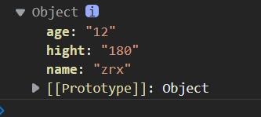

## 数值扩展

> 还记得JS的数值精度`Number.EPSILON`其接近去xxxxxxxx

### 二进制与八进制

```js
// 二进制
let b = 0b1010
console.log(b) // 10
// 八进制
let 0 = 0o777
console.log(o)
```

### 检测有限数

通过`Number.isFinite`来检测一个数值是否是一个有限数

```js
console.log(Number.isFinite(100)) // true
console.log(Number.isFinite(100 / 0)) // false
```

### 检查一个数值是否为`NaN`

```js
console.log(isNaN(123)) // false
```

### 字符与整数翻转

使用反转方法可以将字符串中整数或者字符串去掉。

```js
console.log(Number.parseInt('5211314love'))  // 5211314
console.log(Number.parseFloat('122133爱你')) // 爱你
```

### 判断整数

```js
console.log(Number.isInteger(2.5)) // false
```

### 去除小数部分

```js
console.log(Math.trunc(2.1)) // 2
```

### 判断正数负数零

```js
console.log(Math.sign(100)) // 1
console.log(Math.sign(0)) // 0
console.log(Math.sign(-100)) // -1
```

## 对象扩展

### 判断相等

```js
console.log(Object.is(1,1)) // true
```

### 对象合并

`Object.assign()`后面的对象会覆盖前面的对象相同的属性，多余的属性会被合并。

```js
const obj_one = {
    name:"cxy",
    hight:"180"
}
const obj_two = {
    name:"zrx",
    age:"12"
}

console.log(Object.assign(obj_one,obj_two))
```

