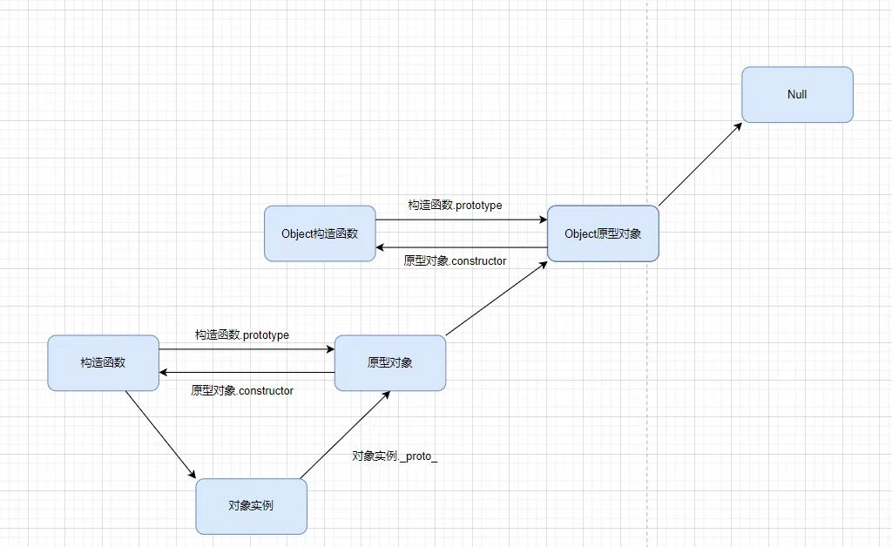

在ES6之前我们是通过使用构造函数和原型来创建对象的

## 构造函数和原型

### 概念

在ES6之前并没有引入类，所以在这之前，我们需要通过构造函数的特殊函数来定义对象

1. 通过new Object创建

   ```js
   var obj new Object()
   ```

2. 通过对象字面创建

   ```js
   var obj = {}
   ```

3. 利用构造函数创建

   ```js
   function People(name,age) {
       this.name = name
       this.age = age
       this.code = function() {}
   }
   var cxy = new People('cxy',18)
   ```

### 构造函数

构造函数是一种特殊的函数，用来初始化对象，当为对象成员变量赋初始值，我们可以通过讲对象的属性和方法抽取并在构造函数中封装

#### 成员

构造函数的成员分为两类，一类为静态成员，一类为实例成员

实例成员：构造函数通过this来添加的成员为实例成员，并且实例成员只能通过实例化的对象来访问，无法通过构造函数访问实例成员

静态成员：在构造函数本身上添加的成员为静态成员如```People.sex = "男"```其中静态成员只能通过构造函数来访问

### 原型对象`prototype`

当我们通过构造函数来实例化对象的时候需要为数据类型开辟额外的内存空间，每次实例化新的对象的时候都会开辟，这就存在着浪费内存的问题，我们打印一下两个实例对象的函数使用```===```来判断就会发现返回为false，因为两个的地址不一样，所以我们的构造函数可以通过原型分配的函数来为所有实例化的对象进行共享，进而解决浪费内存的问题。

JS中每一个构造函数都有一个```prototype```属性，指向另一个对象，其中```prototype```就是一个对象，且其对象的所有属性和方法都会被构造函数所拥有，我们来打印一下```console.log(People.prototype)```就会看到一个对象

那么我们知道了其对象的所有属性和方法都会被构造函数所拥有，所以我们可以将一些不变的方法和属性直接定义再原型对象上，这样的话所有对象的实例就可以共享使用这个方法，不需要额外去开辟内存空间。

```js
People.prototype.code = function() {
    //在原型对象中来动态地添加我们想要共享的方法
}
```

### 对象原型```_proto_```

对象都会有一个属性`_proto_`指向构造函数的`prototype`原型对象，而这个属性就是我们可以使用构造函数的原型对象的属性和方法的根本，因为对象有`_proto_`原型的存在，`console.log(cxy._proto_)`其指向就是我们的原型对象`prototype`，所以我们直接可以拿来使用其对象内的方法

### `constructor`构造函数

对象原型和构造函数原型对象中都有一个`constructor`属性，我们称之为构造函数，因为他指向的是构造函数本身，打印一下`console.log(People.prototype,cxy.__proto__)` 可以看到是相等的，但是如果我们直接使用原型赋值的话。

```js
People.prototype = {
    code: function() {
        
    }
}
```

打印过后的结果和之前不同，所以这种情况我们需要手动去添加构造函数，如下，这样的话再打印就会恢复 

```js
People.prototype = {
    constructor: People,
    code: function() {
        
    }
}
```

## 原型链



> 何为原型链，如图所示，一条链子。

我们先来了解一下这张图的底部，构造函数，原型对象，对象实例，这三者的指向关系

我们的构造函数指向了对象实例，这里是通过构造函数创建对象实例

```js
function People(name) {
    this.name = name
}
let cxy = new People('cxy')
```


```js
function People(name,age) {
    this.name = name
    this.age = age
    // this.code = function() {}
}
People.prototype.code = function() {
    //在原型对象中来动态地添加我们想要共享的方法
}
console.log(People.prototype)
let cxy = new People('cxy',20)
console.log(cxy.__proto__)
```


