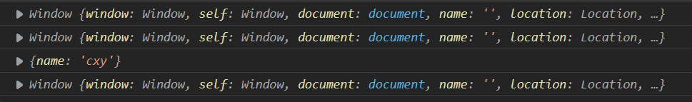
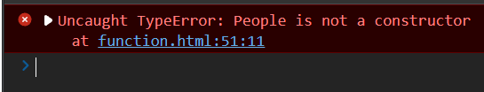
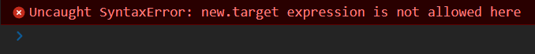
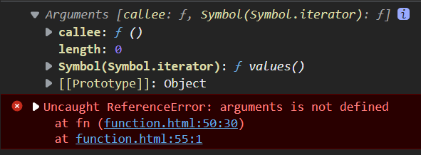

## 箭头函数

### 写法

```js
let fn = (a,b) => {}
```

### 特性

- `this`是静态的，其`this`始终指向函数声明时所在作用域下的`this`值，在之前的函数，它的`this`会指向调用它的实例对象

  我们分别在全局作用域下调用两个函数和通过使用`call`将调用的对象指向`people`看看普通函数和箭头函数的差别。

  ```js
  function getThis() {
      console.log(this)
  }
  let getThis_2 = () => {console.log(this)}
  const people = {
      name: "cxy"
  }
  getThis()
  getThis_2()
  getThis.call(people)
  getThis_2.call(people)
  ```

  结果如下所示，我们可以看到箭头函数的`thsi`指向始终指向全局`window`。

  

- 不能作为构造函数去实例化对象

  ```js
  let People = () => {}
  let cxy = new People()
  ```

  

  这说明箭头函数不能作为构造函数

- 不能使用`super`

  `super`是用来访问和调用父类的构造函数和方法，箭头函数不能使用

- 不能使用`new.target`

  **`new.target`**属性允许你检测函数或构造方法是否是通过`new`运算符被调用的。

  在通过`new`运算符被初始化的函数或构造方法中，`new.target`返回一个指向构造方法或函数的引用。

  ```js
  let fn = () => { console.log(new.target)}
  fn()
  ```

  

- 不能使用`arguments`变量

  `arguments`变量是函数内部用来保存实参的变量，但是箭头函数是不能使用的

  ```js
  let fn = () => { console.log(arguments) }
  let fn_1 = function() {
      console.log(arguments)
  }
  fn_1()
  fn()
  ```

  

- 箭头函数的简写

  当箭头函数有且只有一个形参那么我们可以把`()`省略

  ```js
  let fn = n => {}
  ```

  当函数中只有一行代码的时候可以将`{}`省略，这样的话为会隐式返回值，即我们可以省略`return`

  ```js
  let fn = () => console.log("cxy")
  ```

### 应用场景

我们一般箭头函数常用于一些在嵌套作用域下想通过操作`this`来达到我们的目的的场景

