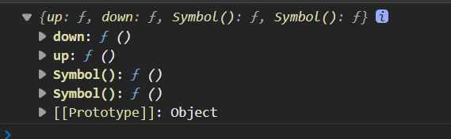

## symbol

> ES6中引入了新的数据类型即`symbol`表示独一无二的值，类似于字符串的数据类型

### 特点

1. `symbol`是唯一的，不能重新创建，用来解决命名冲突的问题

   ```js
   const s1 = Symbol();
   const s2 = Symbol();
   console.log(s1 === s2); // false
   ```

2. `symbol`不能和其他数据进行运算

3. `symbol`定义的对象属性不能使用`for in`循环，但是我们可以通过`Reflect.ownKeys`来获取对象的所有键名

   ```js
   let sym = Symbal()
   console.log(sym,typeof sym)
   // Symbol() ,'symbol'
   ```

   

4. `symbol`

### 创建

#### 普通创建

```js
let sym = Symbol()
```

#### 传参创建

```js
let sym_1 = Symbol('cxy')
```

#### Symbol.for创建

```js
let sum_2 = Symbol.for('cxy')
```

### 应用

#### 添加方法

>  `symbol`通常是用来为对象添加一个独一无二的方法

```js
let game = {
  up:function() {},
  down:function() {}
}
let obj = {
    up: Symbol(),
    down: Symbol(),
}
game[obj.up] = function() {
    console.log("我可以女装")
}
game[obj.down] = function() {
    console.log("mxr可以")
}
console.log(game)
```



#### 添加唯一的值

我们在代码中经常会用字符串或者数字去表示一些状态，也经常会面临缺乏语义性或者重复定义的问题，这时使用Symbol是最好的选择，每次新创建的Symbol都是唯一的，不会产生重复，而且我们可以给Symbol传入相应的描述。

看下面的例子，我们使用Symbol来表达订单的几种状态，而不是字符串和数字

```javascript
let statuses = {
    OPEN: Symbol('已下单'),
    IN_PROGRESS: Symbol('配送中'),
    COMPLETED: Symbol('订单完成'),
    CANCELED: Symbol('订单取消')
};

// 完成订单
task.setStatus(statuses.COMPLETED);
```

