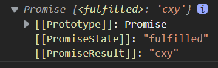
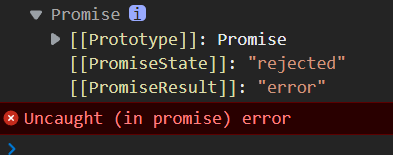
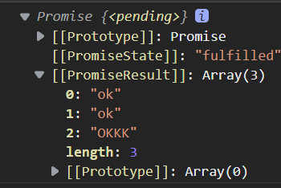
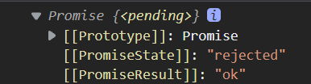

## 异步


### 回调地狱

> 回调地狱是什么？它真的是一个地狱吗

这里给了一个需求需要我们在1s后输出cxy，2s后输出zrx，3s后输出wb

```js
setTimeout(() => {
    console.log(1)
    setTimeout(() => {
        console.log(2)
        setTimeout(() => {
            console.log(3)
        },3000)
    },2000)
},1000)
```

以上就是典型的回调地狱，不停地回调，一层套一层

而用生成器解决呢

```js
function one() {
    setTimeout(() => {
        console.log("111")
        iterator.next()
    },1000)
}
function fn() {
    yield one()
}
```

## `Promise`

### 介绍

`promise`是ES6中引入异步编程的新的解决方案，也就是是`promise`的出现代替了回调地狱的产生，很好地解决了诸多问题，并且从本质上来说`promise`是一个构造函数。

### 优点

`promise`可以顶替回调来进行异步操作，它有如下几个优点

- 链式调用
- 错误抛出
- 灵活调用

### 初步使用

> 以一个抽奖案例来看一下promise

```js
function rand(m,n) {
    return Math.ceil(Math.random() * (n-m+1) + m-1)
}
```

`promise`在实例化的时候需要内置一个参数为一个函数，这个函数可以包裹异步操作，而该函数中有两个参数，一个为`resolve`，一个为`reject`，两个参数的含有分贝为解决和拒绝，并且两个参数都为函数类型的数据，当异步任务成功的时候会调用`resolve`，失败会调用`reject`。

```js
let pro = new Promise((resolve,reject) => {
    setTimeout(() => {
  let number = rand(1,200)
  if(number < 30) {
    resolve(number)
  }else {
    reject(number)
  }
},1000)
})
```

之后我们需要使用`then`来完善成功和失败的两个函数，其中`then`包含两个函数参数，一个为成功执行的回调，一个是失败执行的回调

```js
pro.then(() => {
    console.log("中")
},() => {
    console.log("不中")
})
```

而我们`then`中两个函数可以将异步操作的结果作为参数拿过来

```js
pro.then((res) => {
    console.log("中" + res)
},(err) => {
    console.log("不中" + err)
})
```

### `promise`封装`ajax`请求

```js
function sendAjax(url) {
  return new Promise((resolve,reject) => {
    const xhr = new XMLHttpRequest();
    xhr.open("GET",url);
    xhr.send();
    xhr.onreadystatechange = function() {
      if(xhr.readyState == 4) {
        if(xhr.status >= 200 && ShadowRoot.status<300) {
          resolve(xhr.response)
        }else {
          reject(xhr.status)
        }
      }
    }
  })
}
sendAjax('./').then((res) => {
  console.log(res)
},(err) => {
  console.log(err)
})
```

### `promise`属性

#### `promisestate`

`promsie`在上文提及过它是一个构造函数，那么由他实例化的对象中有有一个属性为`promisestate`表明`promise`的状态，其值如下，并且每个实例对象的这个状态不能由我们手动改变，其为内置的。

- pending：未决定的
- resolve/fullfilled：成功
- reject：失败

#### `promiseresult`

这个属性值存储着异步任务成功还是失败的结果，而这个属性可以通过`resolve`和`reject`进行修改

## `Promise`使用

### `promise`实例对象的api

#### `executor`

在实例化promise对象内包含一个参数为`executor`被称为执行器，而在执行器内部包含两个形参：`resolve`和`reject`，当内部定义成功的时候执行我们的`resolve`当我们内部定义失败的时候调用`reject`，而`executor`会在promise内部立即调用，而我们的异步操作会在执行器内部执行是。

```js
let pro = new Promise((resolve,reject) => {
    console.log("立即执行")
})
```

#### `then`

`then`方法有两个参数，分别是成功执行和失败执行的回调函数，这里需要注意的是当回调执行完后会返回一个新的`promise`对象

#### `catch`

catch只能执行失败的回调 

### `promise`函数的方法

#### `Promise.resolve`

```js
(value) => {}
```

其接受一个参数，并返还一个成功或失败的`promise`对象

```js
let pro = Promise.resolve("cxy")
console.log(pro)
```



当我们参数为一个`promise`对象的时候，其返回的`promsie`对象跟随传进的对象

```js
let pro = Promise.resolve(new Promise((resolve,reject) => {
    reject("error")
}))
console.log(pro)
```



#### `Promise.reject`

该方法是用来快速返回一个失败的对象，和上个`rosolve`相似

#### `Promise.all`

`promise.all()`的参数是一个以promise对象为元素的数组，其返回值也为一个`promise`对象，其状态由`promsie`数组状态决定，当我们的`promise`数组内全部为成功，那么返回值是一个以每个`promsie`成功为元素的数组，如果参数数组内由一个为失败则返回为失败的值

```js
  let pro_1 = new Promise((resolve) => {
    resolve("ok")
  })
  let pro_2 = Promise.resolve("ok")
  let pro_3 = Promise.resolve("OKKK")
  const result = Promise.all([pro_1, pro_2, pro_3])
  console.log(result)
```



```js
  let pro_1 = new Promise((resolve) => {
    reject("ok")
  })
  let pro_2 = Promise.resolve("ok")
  let pro_3 = Promise.resolve("OKKK")
  const result = Promise.all([pro_1, pro_2, pro_3])
  console.log(result)
```



#### `Promise.race`

`promise.race()`和`all`类似，参数都为以`promsie`对象为元素的数组，而其返回值为数组中最先指向出来的`promise`并创建一个新的`promise`返回


## `Promise`关键性问题

### 改变promise的状态

上文提及了`promisestate`这个属性值表明了`promsie`实例对象的状态，而我们如何去改变它是个问题,，它的起始状态是`pending`

#### 调用`resolve`

我们可以通过调用`resolve`函数将`pending`转为`fullfilled`

```js
let pro = new Promise((resolve) => {
    resolve("ok")
})
```

#### 调用`reject`

我们可以通过调用`reject`函数将`pending`转为`rejected`

#### 使用`throw`

我们可以通过使用`throw`抛出错误来改变状态

```js
let pro = new Promise((resolve) => {
    throw "err"
})
```

### 多个回调的调用

```js
let pro = new Promise((resolve) => {
    resolve("ok")
})
pro.then(() => {
    console.log("被执行")
})
pro.then(() => {
    console.log("被第二次执行")
})
```


但是如果我们去掉`resolve`的时候就不会执行，即我们没有改变对象的状态，状态为`pending`，之后的回调都不会被执行。

### 改变状态和执行回调的先后

我们不是很清楚是先改变状态还是先执行回调，当然这两种顺序都是有可能的。

当`resolve`存在于异步任务的时候，回调是先于改变状态执行的

```js
  let pro = new Promise((resolve) => {
    setTimeout(() => {
      resolve("ok")
    }, 2000)
  })
  pro.then((value) => {
    console.log(value)
  })
```

如果我们立即执行`resolve`或者延迟执行`then`那么就是先改状态再执行回调

### `promise`链式调用

```js
let pro = new Promsie((resolve,reject) => {
    setTimeout(() => {
        resolve("ok")
    },1000)
})
pro.then(value => {
    return new Promise((resolve,reject) => {
        resolve("suc")
    })
}).then(value => {
    console.log(value)  // suc
}).then(value => {
    console.log(value)  // undefined
})
```

#### 链式调用的异常处理

```js
let pro = new Promsie((resolve,reject) => {
    setTimeout(() => {
        reject("ok")
    },1000)
})
pro.then(value => {
    
}).then(value => {
    console.log(value)  // suc
}).then(value => {
    console.log(value)  // undefined
}).catch(value => {
    console.log(value)
})
```

我们只需要在实例对象内添加异常处理的`reject`在链式调用的最后添加一个`catch`即可

#### 中断`promise`链

我们只要一种方法来中断`promise`链，只需要在中断处返回一个`pending`状态的`promise`对象，即可中断，上文已提及`pending`状态下是无法执行回调的。

```js
pro.then(value => {
    return new Promise(() => {})
}).then(value => {
    console.log(value)  
}).then(value => {
    console.log(value)  
}).catch(value => {
    console.log(value)
})
```

