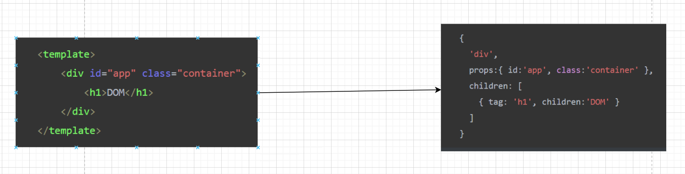

# Vue

## Vue是什么？

vue是一套用于构建用户界面的**渐进式**JS框架，也就是我们把我们得到的数据通过某种形式构成用户能看到的界面

所谓的渐进式，即我们可以随心所欲地根据我们的项目大小引入不同的vue插件，由简单的项目到复杂的项目，随心所欲

官方文档：[Vue.js (vuejs.org)](https://cn.vuejs.org/index.html)

## Vue特点

1. vue采用了组件化的方式，提高了代码的复用率，拿论坛项目来讲，我们可以把一个页面拆成了几个组件，每个组件代表一个文件比如说我们将导航栏封装成一个组件为```nav.vue```，组件内包含了```HTML```,```CSS```,```JS```，然后我们只需要在某个需要这个导航的页面调用这个组件就可以使用，多个页面可以共用这一个组件，这就是组件化的概念

2. vue采用了声明式编码，即我们可以直接通过其**声明式**的方法来渲染我们的数据，我们不需要再操作DOM了

   ```vue
   	 <el-aside width="200px">
           <el-menu background-color="#9ad2f0" text-color="#fff" router>
             <!-- :index中的''很重要 -->
             <el-menu-item
               v-for="item in menuList"
               :key="item.id"
               :index="item.path + ''"
               @click="next(item.menuName)"
             >
               <template slot="title">
                 <i class="el-icon-s-unfold"></i>
                 <span>{{ item.menuName }}</span>
               </template>
             </el-menu-item>
           </el-menu>
         </el-aside>
   ```

   

3. 使用**虚拟DOM**和**diff**算法，复用DOM节点

## 虚拟DOM和DIFF算法

### DOM

我们正常的渲染页面，是通过``list.innerHTML = htmlStr```来进行的，也就是页面的真实DOM


这种真实DOM的渲染有一个问题就是当我们需要新增数据的时候，之前页面上的DOM元素销毁，被我们新生成的DOM覆盖掉

```js
 commonList: [
        { id: 0, menuName: '首页', path: '/welcome' },
        { id: 1, menuName: '前台用户管理', path: '/frontuser' },
      ],
```

```js
 commonList: [
        { id: 0, menuName: '首页', path: '/welcome' },
        { id: 1, menuName: '前台用户管理', path: '/frontuser' },
        { id: 2, menuName: '文章管理', path: '/article' },
        { id: 3, menuName: '资源管理', path: '/resource' },
        { id: 4, menuName: '问答管理', path: '/quiz' }
      ],
```

而我们需要探索一种更好的解决方法，就是我们可以将原来的DOM原封不动，然后通过一种方法来将老DOM和新DOM对比，再添加，这种方法就是我们VUE中的虚拟DOM

### 虚拟DOM

虚拟DOM是添加在数据和真实DOM中间的**中介**，我们拿到数据先创建个虚拟DOM，然后通过虚拟DOM和真实DOM的差异来进行对比，通过**DIFF**算法来实现这个对比新旧DOM的过程。


虚拟DOM的大概实现的情况如下，它将每一个标签都转化为一个对象，且这个对象有三个属性

- **tag**：必选。就是标签。也可以是组件，或者函数

- **props**：非必选。就是这个标签上的属性和方法

- **children**：非必选。就是这个标签的内容或者子节点，如果是文本节点就是字符串，如果有子节点就是数组。换句话说 如果判断 children 是字符串的话，就表示一定是文本节点，这个节点肯定没有子元素



### DIFF算法

Diff 算法，通过新旧虚拟 DOM 对比(即 patch 过程)，找出最小变化的地方转为进行 DOM 操作

