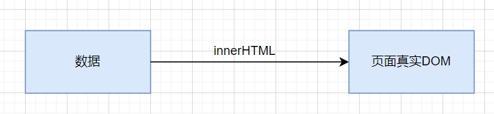
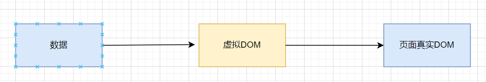
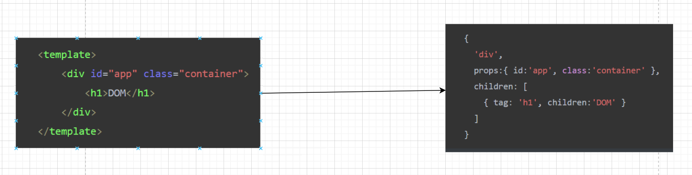

# 模板语法

## 基本简介

### 概念

官方文档指出：Vue.js 使用了基于 HTML 的模板语法，允许开发者声明式地将 DOM 绑定至底层 Vue 实例的数据，初学者对于模板概念不清晰，那么模板到底是什么呢？

翻译一下模板：`template`，常见的Vue文件，都是用模板`template`包裹我们的HTML元素，举个例子：如下就是一个简单的vue模板，有人说这不就是HTML吗，两者还是有区别的，HTML是**静态**的，模板是**动态**的。

```html
<template>
	<div id="app">
        <input type="text" v-model="value">
        <button @click="handleSubmit">submit</button>
        <ul>
            <li v-for="(item,index) in lists" :key="index">{{item}}</li>
        </ul>
    </div>
</template>
```

可以很直观地看到模板内具有**指令**和**插值表达式**，这两者是**动态**的因素

### 原理

模板是如何渲染成我们的原生DOM的？

#### DOM

我们正常的渲染页面，是通过``list.innerHTML = htmlStr```来进行的，也就是页面的真实DOM



这种真实DOM的渲染有一个问题就是当我们需要新增数据的时候，之前页面上的DOM元素销毁，被我们新生成的DOM覆盖掉

```js
 commonList: [
        { id: 0, menuName: '首页', path: '/welcome' },
        { id: 1, menuName: '前台用户管理', path: '/frontuser' },
      ],
```

```js
 commonList: [
        { id: 0, menuName: '首页', path: '/welcome' },
        { id: 1, menuName: '前台用户管理', path: '/frontuser' },
        { id: 2, menuName: '文章管理', path: '/article' },
        { id: 3, menuName: '资源管理', path: '/resource' },
        { id: 4, menuName: '问答管理', path: '/quiz' }
      ],
```

而我们需要探索一种更好的解决方法，就是我们可以将原来的DOM原封不动，然后通过一种方法来将老DOM和新DOM对比，再添加，这种方法就是我们VUE中的虚拟DOM

#### 虚拟DOM

虚拟DOM是添加在数据和真实DOM中间的**中介**，我们拿到数据先创建个虚拟DOM，然后通过虚拟DOM和真实DOM的差异来进行对比，通过**DIFF**算法来实现这个对比新旧DOM的过程。



虚拟DOM的大概实现的情况如下，它将每一个标签都转化为一个对象，且这个对象有三个属性

- **tag**：必选。就是标签。也可以是组件，或者函数

- **props**：非必选。就是这个标签上的属性和方法

- **children**：非必选。就是这个标签的内容或者子节点，如果是文本节点就是字符串，如果有子节点就是数组。换句话说 如果判断 children 是字符串的话，就表示一定是文本节点，这个节点肯定没有子元素



#### 虚拟DOM的生成

虚拟DOM是通过渲染函数（render）生成的，即我们的模板会通过正则被编译成render函数后转变为虚拟dom，这里的编译和我们所理解的编译很像，先生成抽象语法树，再将语法树生成渲染函数。

## 插值

### 插值简介

在模板中最常见的渲染数据的方式就是使用插值，简单的使用理解为：双大括号会将数据解释为普通文本，双大括号内的插值会取组件实例内寻找对应的数据，这种会随组件实例内对应属性的变化而变化。

```html
<span>{{ msg }}</span>
```

### 一次性插值

插值这种渲染方式是有危险的，xss攻击的到来会让我们触不及防，所以只渲染一次插值的设置是有必要的，通过`v-once`指令来只渲染一次数据，达到我们的目的。

```html
<span v-once>{{ msg }}</span>
```

### 原始HTML插值

我们将msg设置为`html`代码，通过插值渲染出来的是相应的html字符串，所以如果我们想要渲染HTML的话，需要使用`v-html="msg"`

### Attribute插值

Attribute插值为HTML属性插值，我们想要改变HTML的属性就需要用到Attribute插值，譬如渲染图片，通过`v-bind`

```html

```

### 支持表达式

插值还可以支持js的表达式，我们可以在双大括号内进行表达式的处理，官网给的例子还是很清晰易懂的。

```
{{ number + 1 }}

{{ ok ? 'YES' : 'NO' }}

{{ message.split('').reverse().join('') }}

<div v-bind:id="'list-' + id"></div>
```

## 指令

### 指令简介

指令，顾名思义，发出某个指令让某个具有能动性的东西做出指令对应得响应，在Vue中指令是以`v-`为前缀的特殊属性（Attribute）

```html
<p v-if="seen">看的到我吗？</p>
```

关于指令能做什么，官方的介绍是，当表达式的值改变时，将其产生的连带影响，响应式地作用于 DOM。

我简单地用指令概念解释一下就是我们可以通过指令命令DOM做出某种响应，比如我通过`v-if`指令来控制DOM的显示与隐藏

### 指令参数

在Attribute插值中我们用到了`v-bind`指令，而指令的参数可以通过`v-bind`来响应式得更新Attribute的值

### 动态参数

在Vue3.x之前我们动态参数的设置是这样的

```
<div v-bind="{ [key]: value }"></div>
<div v-on="{ [event]:  handler }"></div>
```

在Vue3.x之后支持了动态参数的使用，使其更加优雅，下列组合等价于`<a v-bind:href="url"> 动态参数的应用</a>`

```html
<a v-bind:[attributeName]="url"> 动态参数的应用</a>
```

```js
export default {
  data () {
    return { attributeName: "href" }
  }
}
```

### 修饰符

修饰符官方给的说法是修饰符 (modifier) 是以半角句号 `.` 指明的特殊后缀，用于指出一个指令应该以特殊方式绑定，那么修饰符到底能干什么呢。我的个人理解是在指令后加修饰符可以使指令做出相应修饰的额外动作，可以更简单地理解为加个**buff**。当然这个buff是可以**叠加**的。

常见的修饰符如下：

#### 表单修饰符

1. `.lazy`：双向绑定的输入框数据会随着输入数据随时更改，而使用修饰符只有当光标离开input框才会更新数据
2. `.trim`：过滤掉首位的空格
3. `.number`：限制输入数字类型

#### 事件修饰符

1. `.stop`：阻止事件冒泡，相当于调用了`event.stopPropagation()`方法
2. `.prevent`：阻止默认行为，相当于调用了`event.preventDefault()`方法，比如表单的提交、a标签的跳转就是默认事件
3. `.self`：和阻止冒泡类似，只有元素本身触发时才触发方法。


