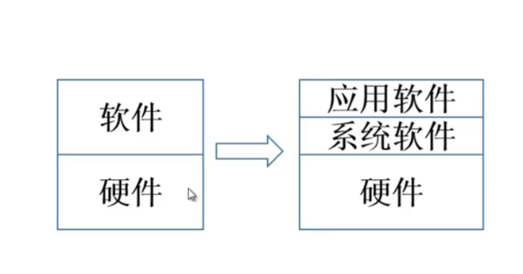

# 计算机系统简介

## 现代计算机的组成

### 现代计算机的多态性

温度传感器-个人数字助理-笔记本-服务器-高性能计算机（hpc）

### 计算机组成

计算机系统主要由硬件和软件组成

#### 硬件

硬件包括计算机实体，如主机，外设，看得见摸得到的部分

#### 软件

由具有各类特殊功能的信息程序组成

##### 系统软件

系统软件用来管理整个计算机系统即管理**硬件+软件**，譬如

1. 语言处理程序
2. 操作系统
3. 服务性程序
4. 数据库管理系统
5. 网络软件

##### 应用软件

按任务需要编制各种程序，譬如游戏

### 层次结构

#### 物理抽象

#### 程序抽象

1. 微指令 - 微程序机器M0
2. 机器语言 - 实际机器M1
3. 操作系统 - 虚拟机器
4. 汇编语言 - 虚拟机器M2
5. 高级语言 - 虚拟机器M3

