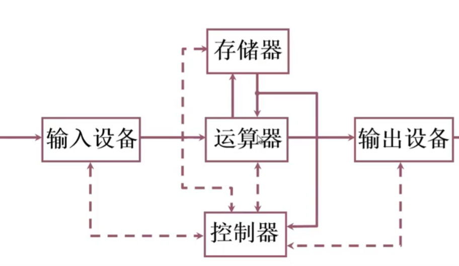
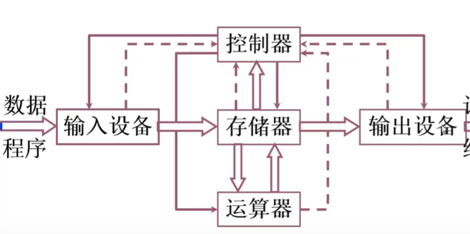
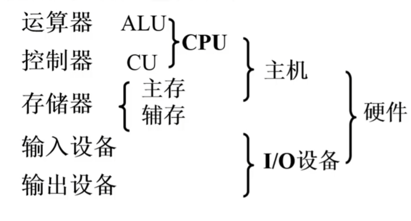
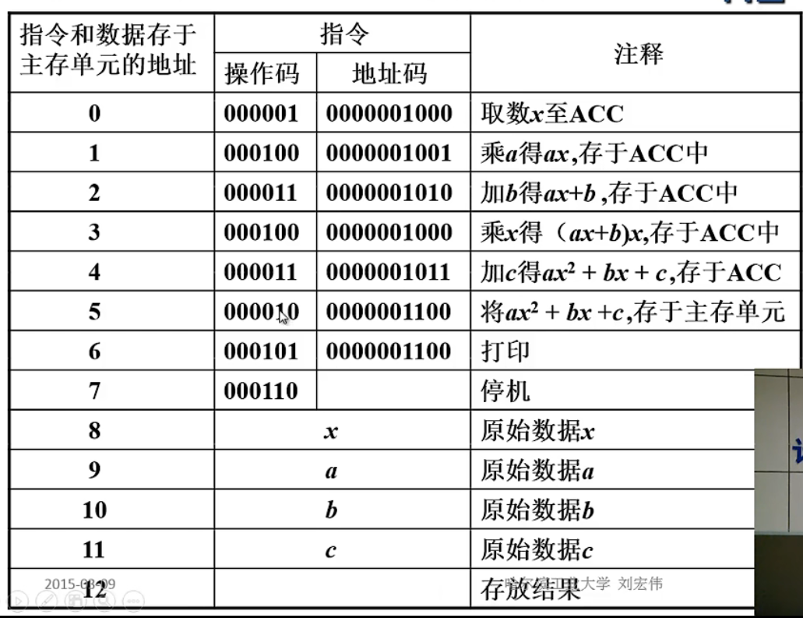

## 冯诺依曼计算机

### 特点

1. 计算机由五大部件组成
2. 指令和数据以同等地位存于存储器，可以按地址寻访
3. 指令和数据用二进制表示
4. 指令由操作码与地址码组成
5. **存储程序**，程序存放在存储器中
6. 以运算器为中心

以**算盘**举例：算盘构成五大部件

1. 算盘珠：运算器
2. 控制器：人
3. 算盘珠：存储器
4. 输入设备：手指
5. 输出设备：算盘珠

### 硬件框图

1. 运算器：算术运算，逻辑运算
2. 存储器：存放数据和程序
3. 控制器：指挥控制程序的运行
4. 输入设备：将信息转换为计算机能够识别的信息
5. 输出设备：将结果转换成人们熟悉的形式

### 系统改进

由运算器为中心的系统有很多弊端，我们需要改进这个结构，将运算器为核心转变为以存储器为核心的系统结构。

## 现代计算机

### 硬件框图

## 系统复杂性管理方法

- 层次化：将被设计的系统划分为多个模块，分别对各个模块进行设计，将问题由大转变为小问题。
- 模块化：有明确定义的功能与接口，有模块化设计的子模块，模块，可以合成在一起。
- 规则性：通过规则性，使模块很容易被重新使用，在模块划分的过程中，模块的接口和功能使其满足某个标准，这样就可以进行复用，有些像**组件化思想**

## 计算机可解决问题

一个现实问题：如何用计算机来解决，先判断是否能通过计算机来解决，判断过后思考用计算机如何来解决

1. 建立数学模型
2. 确定计算方法

### 六条指令

我们进行一个计算操作：ax^2+bx+c需要六条指令

指令包含16位，6位表示操作码，10位代表内存单元地址

拿取数指令举例： 00001表示取数 0000001000表示内存，结合在一起表示将 0000001000内存单元得数取出

- 加法指令
- 乘法指令
- 取数指令 
- 存数指令
- 打印指令
- 停机指令

开始运算：

1. 将x取至运算器中（运算器中的累加器（寄存器））
2. 将内存中的数据和累加器中的x在运算器中进行乘法（保存x^2在累加器中）
3. 乘以a在运算器中（保存ax^2在累加器中）
4. 转存ax^2保存到存储器中（存数指令）
5. 将x取至运算器中
6. 乘以b在运算器中
7. 加ax^2在运算器中
8. 加c在运算器中

如果使用秦九韶算法，将ax^2+bx+c转变为(ax+b)*x + c

1. 取x
2. 乘以a
3. 加b
4. 乘以x
5. 加c

由上图来看指令和数据以同等地位保存在存储器中，且指令和数据都是二进制**（冯诺依曼风格）**

## 存储器的基本组成

### 构成

存储器的核心结构就是存储体，能够保存指令和数据，并且还可以对存储体进行访问，进行取数据取指令等操作

存储体是由若干个**存储单元**构成（存储单元是一个电子设备由多个存储元件组成）总结来看就是：存储体-存储单元-存储元件（0/1）

- 存储单元：存放着一串二进制代码，也就是指令和数据
- 存储字：存储单元中二进制代码的组合
- 存储字长：存储字的长度（二进制代码的位数）

每个存储单元都有一个地址，每个存储单元存放一个存储字，通过地址来访问存储单元，**取出-执行**

### MAR

存储器地址寄存器，保存了存储单元的地址，MAR的位数与存储单元有关，反映存储单元的位数

### MDR

