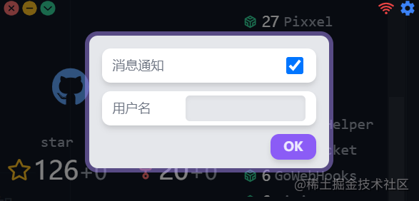
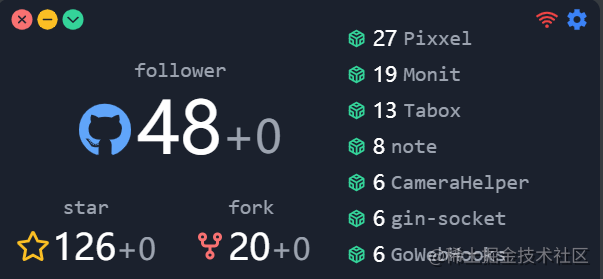

## 前言

身为一名热爱开源的程序员，如果自己的项目在开源社区被star是非常开心的事情，那么如果我们每天工作或者学习的时候打开电脑，就能看到我们的github情况，又或者这个时候有人送给你了一个star，那心情，立马就好起来了，所以接下来我将给大家介绍基于vue + electron开发的监测github的**star**，**fork**，**repository**，**follower**信息的跨端桌面应用。

下面我会从这个应用的一些功能的实现细节讲起，包括**初始化**，**开机自启**，**托盘菜单**，**存储用户数据**，**GitHub信息健康**，除此之外还有还有项目的**使用方式**与**功能介绍**，希望可以给掘友带来帮助。
## 应用初始化
在app目录入口文件`main.js`中我们需要如下工作：
1. 引入模块
2. 选择模式（因为选要有调试模式使用一些工具）
3. 注册协议
4. 窗口配置
5. 就绪启动
### 调试模式
通过环境的判断来设置布尔值
```js
const isDevelopment = process.env.NODE_ENV !== 'production'
```
通过布尔值来进行开发工具的启用，因为是使用vue+electron，所以用到了vue-devtools
```js
app.on('ready', () => {
  if (isDevelopment && !process.env.IS_TEST) {
    try {
      installExtension(VUEJS3_DEVTOOLS)
    } catch (e) {
      console.error('Vue Devtools failed to install:', e.toString())
    }
  }
})
```

### 就绪启动

在应用初始化的`ready`事件中进行启动，关于app控制应用程序的事件生命周期。可以参考官方文档[app | Electron (electronjs.org)](https://www.electronjs.org/zh/docs/latest/api/app#%E4%BA%8B%E4%BB%B6)
```js
app.on('ready', async () => {
  initTray()
  appEvent()
  setTimeout(() => {
    autoWindow()
  }, 300)
  autoUpdater.checkForUpdatesAndNotify()
})

```
- 初始化系统托盘:`initTray()`
- 应用事件监听: `appEvent()`
- 启动窗口:`autoWindow()`(**这里需要注意的是使用了定时器是因为其用于适配Linux系统窗口不透明的问题**)
- 检查更新:`autoUpdater.checkForUpdatesAndNotify()`
## 存储用户数据
由于桌面应用退出后需要保存用户的信息，vue是无法保存的，所以我使用了**electron-store**，在应用退出后来保存用户的github数据，并且它是以文件形式缓存数据，保存，当然我们首先`npm install electron-store`，这里是封装了一个storage文件模块化调用即可。

```js
import Store from 'electron-store'

// 初始化 store
const store = new Store({
  // 版本更新初始化
  migrations: {
    '>=0.3.0': (store) => {
      store.clear()
    },
  },
})

// 获取存储值
export const cget = (node, key, def) => {
  const value = store.get(node + '.' + key)
  return value === undefined ? def : value
}

// 设置存储值
export const cset = (node, key, value) => {
  return store.set(node + '.' + key, value)
}
```

## GitHub信息监控
### 数据获取
在页面组件中我们通过上面封装的函数进行数据的设置与获取，这里又封装了一下，让参数更加自由一些
```js
// 信息获取
const get = (key, def) => {
  return cget('github', key, def)
}

// 信息保存
const set = (key, value) => {
  return cset('github', key, value)
}
```
在我们的data项中直接初始化设置数量，比如star数
```js
 star: get('star', 0), // star 数
 newStar: get('star', 0), // 新 star 数
```
### 实时更新
在mounted生命周期中使用定时器调用`getGithubData()`函数进行数据更新，一分钟更新一次
```js
setInterval(() => {
      this.getGithubData()
}, 60000)
```
### 数据更新
定时获取后我们是通过计算属性来拿到实时更新的加减，下面拿计算属性中的fork数更新举例
```js
forkChange() {
      const changeNum = this.newFork - this.fork
      if (changeNum != 0) {
        this.sendNotice('fork is changed')
      }
      if (changeNum >= 0) {
        return '+' + changeNum
      } else {
        return changeNum
      }
    },
```
做一个数据的判断，并且如果有数据更新就触发提示函数。

## 托盘菜单
electron托盘的创建是依靠Tray来实现的，所以我们第一步是创建一个Tray，参数为图标路径
```js
let TrayMenu = new Tray(__static + '/icon.png')
```
之后通过`Menu.buildFromTemplate`创建菜单项，比如
```js
const contextMenu = Menu.buildFromTemplate([
    { label: '插件列表', submenu: pluginMenu },
    { label: '插件自启', submenu: pluginOpen },
    { label: '退出', click: () => app.quit() },
  ])
```
通过我们创建的托盘实例调用`setContextMenu`，传入我们的菜单项，设置菜单
```js
TrayMenu.setContextMenu(contextMenu)
```
最后在入口文件调用即完成托盘的初始化
## 开机自启
1. 在托盘模块引入app
```js
import { app, Tray, Menu } from 'electron'
```
2. 在托盘中设置开机自启功能项
```js
{
      label: '开机自启',
      type: 'checkbox',
      checked: app.getLoginItemSettings.openAtLogin,
      click: () => {
      
      },
},
```
3. 获得是否选择开机自启的布尔值
```js
const open = app.getLoginItemSettings.openAtLogin
```
4.调用`setLoginItemSettings`api设置启动
```js
app.setLoginItemSettings({ openAtLogin: !open })
```


## 如何使用

掘友们想基于现在的版本继续向上开发，比如说：一个实时监测掘金信息的桌面应用（我也想这么干来着）

克隆下来二次开发：项目传送门：[监控github信息的桌面小组件 (github.com)](https://github.com/fzf404/Monit)

又或者直接下载使用，支持`linux`,`window`,`mac`。

1.  下载地址：[ fzf404/Monit (github.com)](https://github.com/fzf404/Monit/releases)
2.  当前版本（[0.2.4](https://github.com/fzf404/Monit/releases/tag/v0.2.4)）：

🚨 `v0.3.0` 版本前的最终版，`v0.3.0` 起会引入插件机制，除 Github 外还支持其他平台及电脑控制。

✨ Mac 系统安装可能会提示 `Monit.app 已损坏`，请参考 项目中`README.md` 中的 `安装` 部分

🚑 目前只支持 Windows 端自动检查更新

✨ 支持了各平台的开机自启，增加了消息通知功能

♿ 菜单栏增加了 开机自启 和 消息通知 的开关

## 功能介绍




1.  启动或点击右上角设置按钮会弹出信息模态框，输入你的github用户名即可（说起来还可以监测其他人的github信息）




2.  左上角第三个按钮的作用分别为是`退出`,`隐藏`,`置顶/取消置顶`

3.  左侧依次为用户获得的`follower、star、fork`总数并可以显示实时动态

4.  当数字变动时点击可查看变动详情

5.  右侧为全部仓库及`star`数，点击可跳转到浏览器查看仓库详情，仓库列表可以滚动

6.  网络异常时右上角红色图标会有一个断网指示

## 下一步的想法

想要增加好玩且实用的功能比如说：
1. 音乐播放器
2. todo代办项
3. bilibili创作监测
4. 掘金创作信息监测
5. 目前项目中初步搭建好了todo还有bilibili的文件，如果掘友感兴趣可以进行二次开发并提pr。
