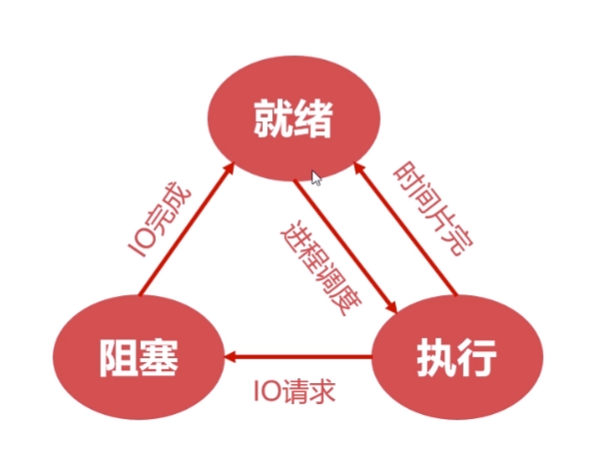
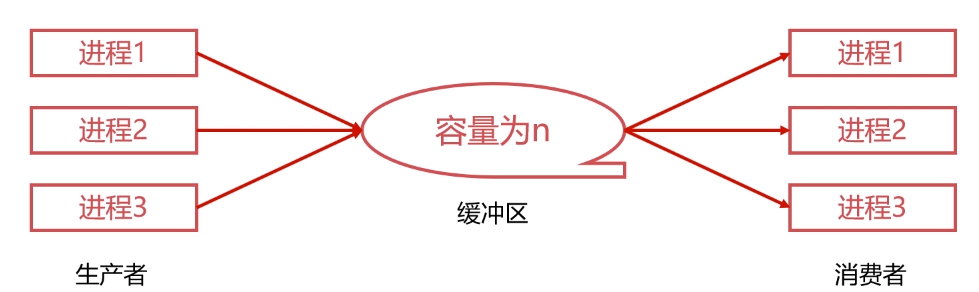
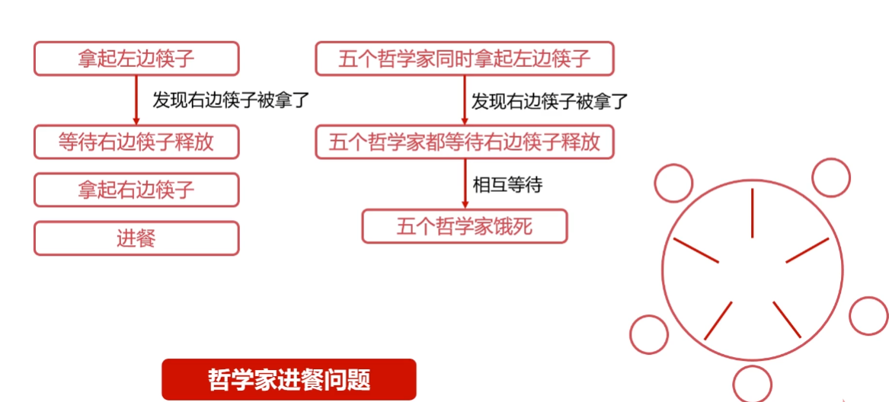

# 进程

进程是系统进行资源分配和调度得基本单位，作为程序独立运行的载体，保证程序的正常运行，使得操作系统的资源利用率大大提升

## 进程的实体

### 主存中进程形态

在主存中进程也是一段连续存储的空间，它包括了标识符，状态，优先级，程序计数器，内存指针，上下文数据，IO状态信息，记账信息等

#### 标识符

标识符是唯一标记进程的符号，用于区别其他进程，也就是进程ID

#### 状态

标记进程进行的状态，比如说运行态，阻塞状态

#### 程序计数器

进程即将被执行的下一条指令的地址

#### 内存指针

程序代码，进程数据相关的指针

#### 上下文数据

进程执行时处理器存储的数据

#### IO状态信息

存储了进程IO操作所占用的文件列表

#### 记账信息

使用处理器时间和时钟数总和

### 进程控制块（PCB）

- 进程中用于描述和控制进程运行的通用数据结构
- 记录进程当前状态和控制进程运行的全部信息
- PCB使得进程是能够独立运行的基本单位
- 所以PCB是操作系统进行调度经常会被读取的信息
- PCB是常驻内存，存放在系统专门开辟的PCB区域

### 进程与线程

在一个进程中会有多个线程在执行，也就是说进程和线程之间是一对多的关系，线程是包含在进程中的，并且一个进程可以迸发多个线程，多个线程可以执行不同的任务。

|          |        进程        |         线程         |
| :------: | :----------------: | :------------------: |
|   资源   | 资源分配的基本单位 |      不拥有资源      |
|   调度   | 独立调度的基本单位 |  独立调度的最小单位  |
| 系统开销 |   进程系统开销大   |    线程系统开销小    |
|   通信   |      进程IPC       | 读写同一进程数据通信 |

#### 进程（Process）

系统进行资源分配和调度的**基本单位**

#### 线程（Thread）

操作系统进行运行调度的**最小单位**

## 无状态模型

### 就绪

当进程被分配到除CPU以外所有必要的资源后，只要获得CPU的使用权，就可以立即运行进程，而当所有资源都准备好，只差CPU资源的使用权，这个状态就为就绪状态。

#### 就绪队列

在系统中会有多个处于就绪状态的进程，他们将会排成一个队列，这个队列就称为就绪队列

### 阻塞

进程如果因为某种原因：其他设备未就绪而无法继续执行，从而放弃CPU的状态被称为阻塞状态。

#### 阻塞队列

阻塞的进程会被存储在队列中，被称为阻塞队列  

### 执行

进程获取到CPU的使用权后，程序正在执行，这个状态被称为执行状态，在单核处理机，在某个时刻只能有一个进程是处于执行状态的。

### 三状态的转化

就绪状态：发生进程调度转变为：执行状态：时间片用完（分配给进程执行的CPU时间耗尽）:转变为就绪状态。

执行状态：发送IO请求有可能转变为阻塞状态：阻塞状态如果IO完成则将转变为就绪状态。

### 创建

以下为创建状态的过程

1. 分配PCB
2. 插入就绪队列

创建进程时用于PCB但是其他资源未就绪，这种状态就是创建状态。

### 终止

1. 系统清理
2. 归还PCB

进程结束由系统清理或归还PCB的状态被称为终止状态。 

## 进程同步

### 生产者和消费者问题

生产者进程生产产品，产品提供给消费者进程进行消费，生产者进程和消费者进程是可以并发执行得，两者之间设置了一个具体n课缓冲区的缓冲池，生产者进程需要将产品放在一个缓冲区，消费者进程可以从缓冲区拿走产品进行消费。

缓冲区再Cache上，需要三个步骤来操作缓冲区

1. 取出缓冲区数据存储在寄存器中（register=count）
2. 寄存器中产品+1（代表生产出一个产品）(register = register+1)
3. 将数据存放会缓冲区中(count = register)

这里是将寄存器比作生产者和消费者，来表达这个模型，但是如果生产者和消费者两者并发执行的话会有可能出错，因为两者都并发控制缓冲区，会导致数据的不一致问题。

### 哲学家进餐问题

五个哲学家生活方式是交替地进行思考和进餐，共同使用一张圆桌，座有五把椅子，五至筷子和五个碗，哲学家只进行思考，饿了就试图靠近左右两支筷子，只有两支筷子全都被拿到才能进餐，进餐完毕放下筷子继续思考。

1. 一个哲学家拿起来了左边地筷子
2. 发现右边筷子被另一个筷子被另一个哲学家占用了，等带另一个哲学家释放这个筷子
3. 拿起右边的筷子

那如果五个哲学家同时要吃饭，同时拿起了左边的筷子，然后发现右边的筷子被占用了，相互等待，没有循环。

### 进程同步解决问题

进程同步的作用就是对竞争资源在多进程间进行使用次序的协调，使得并发执行的多个进程之间可以有效使用资源和相互合作。

### 同步原则

#### 临界资源

临界资源值得是作为共享资源但是无法同时被多个线程共同访问的共享资源，只有临界资源被释放其他进程才能使用该临界资源。

#### 原则

- 空闲让进：资源无占用，允许使用
- 忙则等待：资源有占用，请求进程等待
- 有限等待：保证有限等待时间能够使用资源
- 让权等待：等待时，进程需要让出CPU

### 线程同步

进程中多个线程并发使用资源也会出现上述问题，所以也需要有线程同步来解决这些问题
