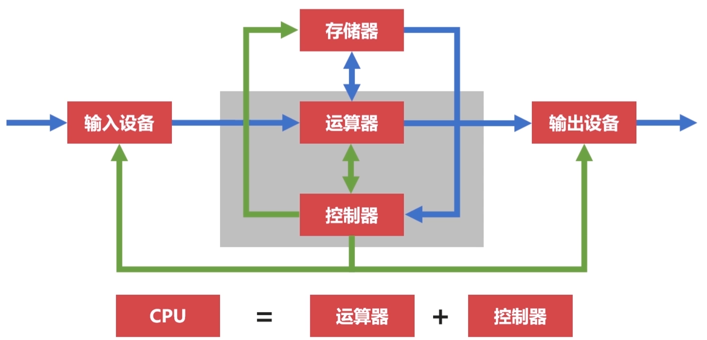
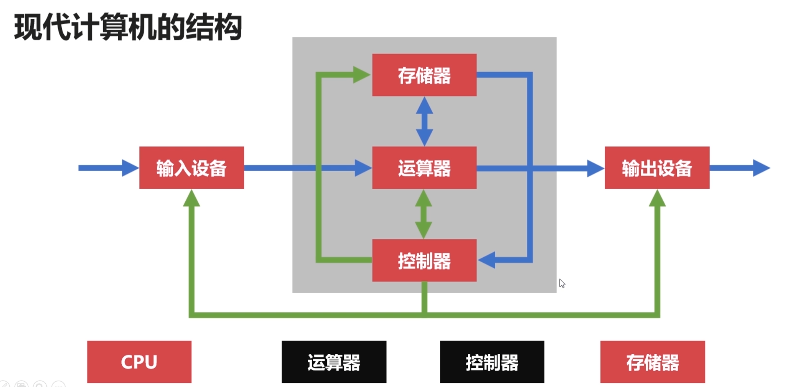
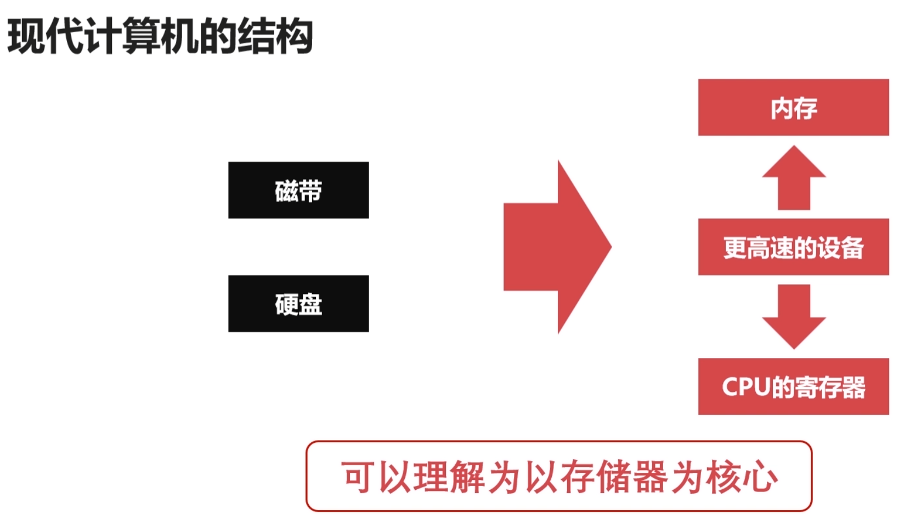

## 冯诺依曼体系

冯诺依曼体系将计算机体系更改，将计算机设计为通用的，每个程序都可以在上面运行，无需重新修改，而冯诺依曼体系将程序指令和数据一起存储的计算机设计概念结构

- 存储器：存储运行数据和数据，能够长期记忆程序，数据，结果
- 控制器：控制程序运行
- 运算器：完成运算操作，具备算数，逻辑运算，数据传送等加工处理数据的方式
- 输入设备：将需要使用到的程序和数据输入给计算机（鼠标，键盘）
- 输出设备：按要求将结果送给用户（显示器，打印机）

### 冯诺依曼瓶颈

我们将cpu和存储器分开会导致一个问题就是冯诺依曼瓶颈，即CPU和存储器速率之间的问题无法调和，也就是说cpu在将处理完数据之后只能等待存储器传输，因为存储器的传输速率慢，cpu处理速率快，所以会导致这个问题。

## 现代计算机结构

现代计算机结构可以解决冯诺依曼瓶颈，解决cpu和存储器之间的速率问题

从图来看现代计算机的CPU包含了运算器，控制器，存储器

