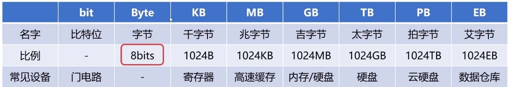

## 容量单位

> 800M的光盘，4G的内存，2T的硬盘

在物理层面会使用高低电平记录信息，所以只有0/1两种状态，0/1被我们称为bit，也就是比特位。

而我们所最常见的单位：字节 1Byte = 8bits，一个字节等于八个比特位

因为不断地增加内存所以更多的单位迸发了出来

## 速度单位

### 网络速度

网络速度：Mbps

100M/s = 100bits/s = 100/8 MB/s = 12MB/s

### CPU速度

CPU的时钟频率：赫兹HZ，代表着秒分之一，每秒钟周期变动的重复次数的计量，也就是CPU中高低电平每秒钟变换的次数

