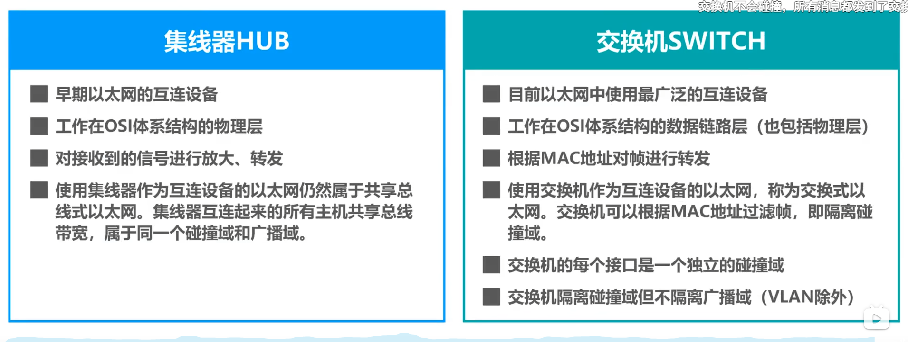
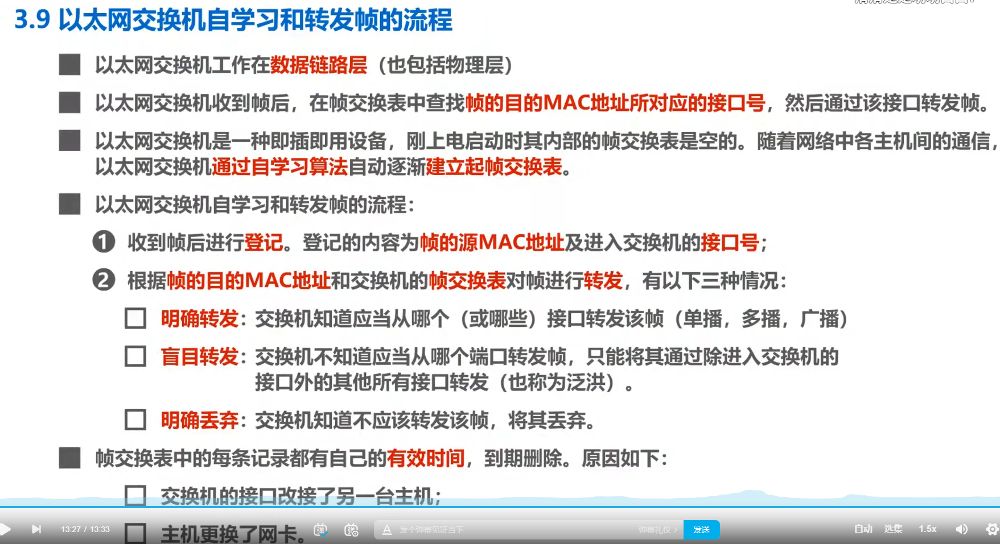
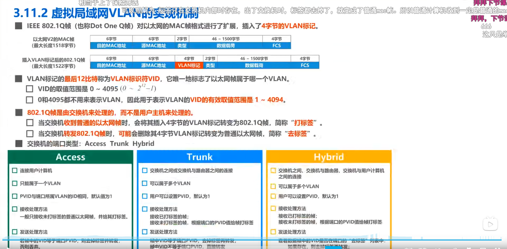

## 第三章

### 媒体接入控制

### 集线器与交换机得区别

### 以太网自学习

### 虚拟局域网

1. 数据链路层与链路有何区别？链路接通了与数据链路接通了的区别何在？

   链路是结点之间的物理链路，而数据链路是在链路的基础上加上通信协议

   链路接通是两端结点的交换机开机，可以传输比特流，但是此时是不稳定的，数据链路接通是在链路接通的基础上增加了，检测，确认，重传等功能使得不太可靠的链路连接变成稳定的数据链路连接

2. 数据链路层的三个基本问题？为什么都必须加以解决？

   封装成帧，透明传输，差错检测

   - 封装成帧：必须将数据的前后加上帧首与帧尾，形成帧定界，且帧定界是分组交换的必要条件
   - 透明传输：为了数据信息和控制信息发生混淆的时候都能及时处理
   - 差错检测：防止差错的无效数据帧，浪费网络资源。

3. PPP协议的主要特点是什么？为什么PPP不使用帧的编号？PPP适用于什么情况？为什么PPP协议不能使数据链路层实现可靠传输？

   PPP协议主要特点:简单,提供不可靠的数据报服务,检错,无纠错, 不使用序号和确认机制地址字段A 只置为 0xFF。地址字段实际上并不起作用。控制字段C 通常置为 0x03。 PPP 是面向字节的当 PPP 用在同步传输链路时，协议规定采用硬件来完成比特填充（和HDLC 的做法一样），当 PPP 用在异步传输时，就使用一种特殊的字符填充法

   为了简单，ppp协议不提供可靠服务

   PPP适用于线路质量不太差的情况下、

   PPP没有编码和确认机制

4. 发送数据为101110，使用CRC冗余码多项式是x^3+1，求余数

5. 

6. 

7. 

8. 

9. 主机的IP地址201.1.12.120，子网掩码为255.255.255.240，求出其子网号、主机号、直接广播地址及受限广播地址。

   据该主机的IP地址，可以判断出一个C类地址，其中三个字节为网络号，一个字节为主机号。所以子网只能在最后一个字节内划分。子网掩码中的240表示为二进制11110000，说明子网号为前4位，主机号为后4位。对于IP地址201.1.12.120中的120，表示为二进制01111000，与子网掩码中的240（二进制为11110000）进行“与”运算，得出其子网号为0111即十进制的7，主机号位1000即十进制的8，直接的广播地址为201.1.12.127 ，受限广播地址为255.255.255.255。

   如果子网掩码是255.255.192.0，那么下列的哪些主机（A. 168.1.191.21 B. 168.1.127.222 C. 168.1.130.33 D. 168.1.148.122）必须通过路由器才能与主机H：168.1.144.16通信？

   从主机H的IP地址为168.1.144.16及子网掩码为255.255.192.0可以看出这是一个B类网络，第3个字节的前2位表示子网号。如果要和H主机直接通信（不需要路由器的转发），只要和H主机在相同的子网即可。因此，只需要把给出的各个主机的IP地址的第3个字节转换成二进制，并分别与子网掩码进行二进制“与”操作，然后与目的主机相比较，如果子网号不相同，表示需要路由器转发。经过计算，给定主机的IP地址与A、C、D的IP地址进行与操作的结果均为10000000（十进制的128），只有B的子网号与主机H的子网号不同，为01000000（十进制的64），所以主机B要与目的主机通信必须通过路由器的转发。

10. ip数据报的转发过程

    a.主机H1首先构造一个源IP地址为202.99.98.18、目的IP地址为202.99.98.35的IP数据报，然后将该数据报传送给数据链路层；

    b.数据链路层的实体通过主机H1的ARP协议获得路由器R1（202.99.98.17）所对应的MAC地址，并将其作为目的MAC地址填入封装有IP数据报的帧，然后将该帧发送出去；

    c.路由器R1收到该帧后，去除帧头与帧尾，得到IP数据报，然后根据IP数据报中的目的IP地址（202.99.98.35）去查找路由表，得到下一跳地址为直接交付；

    d.然后路由器R1通过ARP协议得到主机H2的MAC地址，并将其作为目的MAC地址填入封装有IP数据报的帧，然后将该帧发送到子网net2上；

    e.主机H2将收到该帧，去除帧头与帧尾，并最终得到从主机H1发来的IP数据报。

   